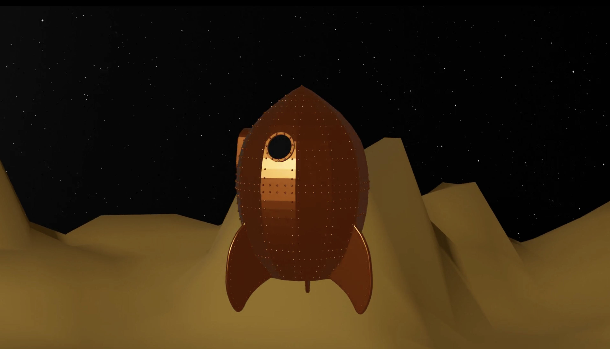
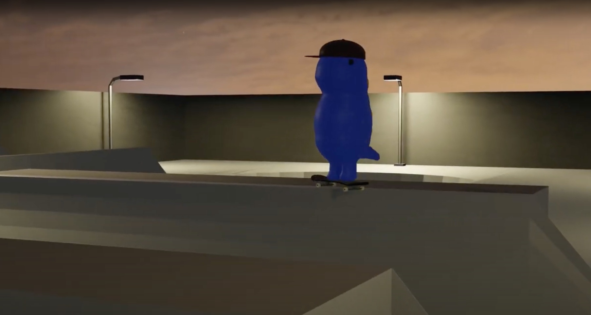
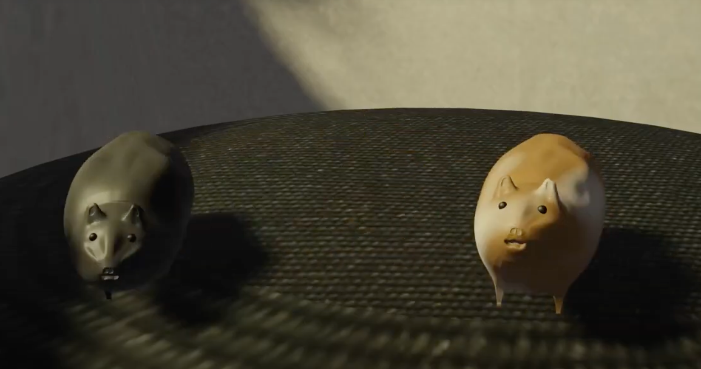

# Blender Renders

## Table of Contents

- [Stills](#stills)
  - [Primitive Mine](#primitive-mine)
  - [Project Engineering](#project-engineering)
  - [The Unusual Teapot](#the-unusual-teapot)
  - [Year of the Cat](#year-of-the-cat)
- [Animations](#animations)
  - [Grand Day Out](#grand-day-out)
  - [Daiso Dino Skateboarding Animation](#daiso-dino-skateboarding-animation)
  - [Tony and Felix’s Search For Treats](#tony-and-felixs-search-for-treats)

## Stills

### Primitive Mine
*This Blender scene depicts a mining environment constructed from primitive objects. It features a mine cart filled with colorful blocks representing various minerals, a pile of angular rocks, and a wooden ladder structure. The lighting highlights the mine entrance, creating depth through shadows.*

  

---

### Project Engineering
*In this Blender scene, I recreated an office environment inspired by my internship at Largo Concrete as a project engineer. The scene features a desk with a detailed structural drawing, accompanied by essential drafting tools like a protractor and slide ruler. Vintage tools were added to evoke the aesthetics of civil engineering in the late 19th and early 20th centuries. Various documents and a vintage lamp add to the ambiance, creating a realistic setting reminiscent of the era.*

  

---

### The Unusual Teapot
*In this Blender scene, I experimented with geometry nodes to create star particle effects, enhancing the overall atmosphere of the environment. I drew direct inspiration from the Season 4 intro of the Twilight Zone television show, aiming to capture its surreal and otherworldly feel.*

  

  

---

### Year of the Cat
*This Blender scene is a recreation of the album cover for Year of the Cat by Al Stewart, one of my favorite albums growing up. The composition features various elements from the album art, including a colorful table adorned with playful objects like a cat-themed lamp, cosmetics, and other personal items.*

  

  

---

## Animations

### Grand Day Out
*Recreation of the iconic rocket from Wallace and Gromit: A Grand Day Out. This project marks my first attempt at animation.*

 

### Daiso Dino Skateboarding Animation
*Daiso Dino plushy performing skateboarding tricks in a stylized skate park.*

 

### Tony and Felix’s Search For Treats
*Dedicated to my family's pet hamsters, Tony and Felix, showcasing their unique personalities.*

 

---
